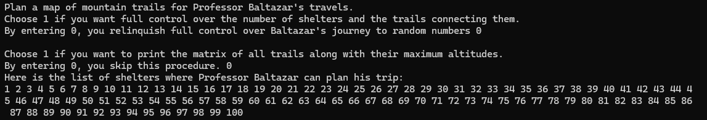
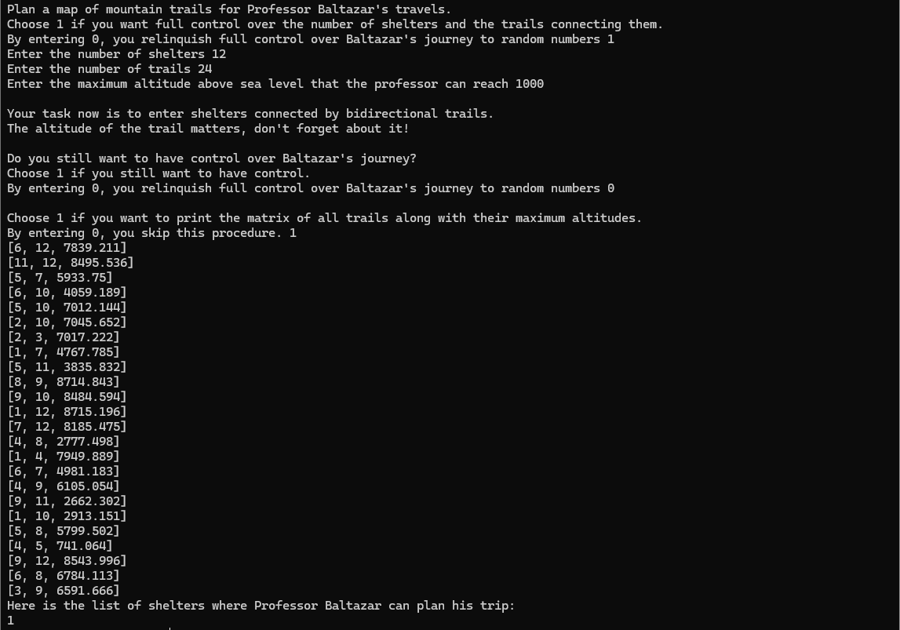
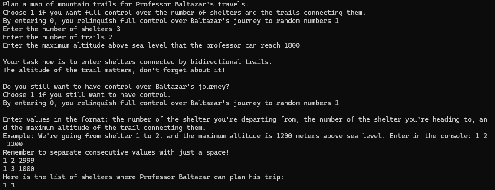

# Winter mountain hikes

Based on the map of the mountain resort, Professor Baltazar plans to hike between \( n \) shelters, using \( m \) bidirectional trails. For safety reasons, he restricts his routes to trails not exceeding an altitude of \( M \) meters above sea level.

The task is to indicate all the shelters that Professor Baltazar could safely reach. The selection criterion is the altitude of the trails, meaning we discard those paths whose altitude above sea level exceeds \( M \) meters.

## Inspiration

The project was an assignment that we were supposed to complete in two-person groups as part of our algorithms and data structures class. I was responsible for the code in the project, while my teammate prepared a report (file Report.pdf in Polish language version) that thoroughly describes not only the operation of the program but also provides the results of the time complexity analysis of the algorithm used.

## Technologies

The project was written in Python, using the breadth-first search (BFS) algorithm for graph traversal.

## How to run application?

To run the script, type in console: <strong>python Winter_mountain_hikes.py</strong>.

## Examples
There are three levels of controlling the application's operation.

### Full randomization

### Partial randomization

### Without randomization

